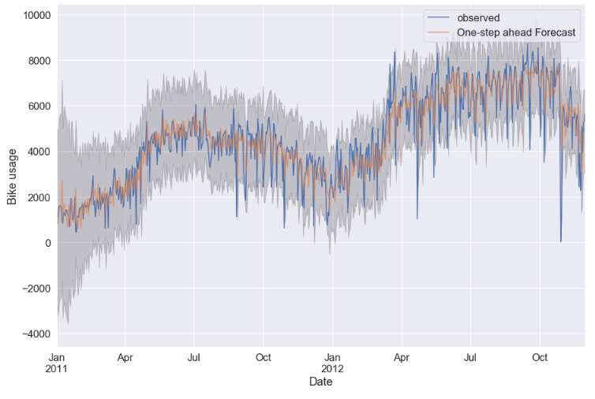
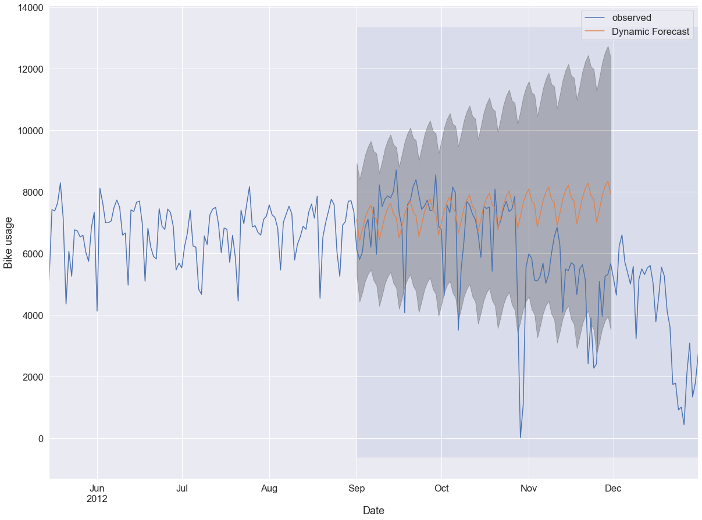
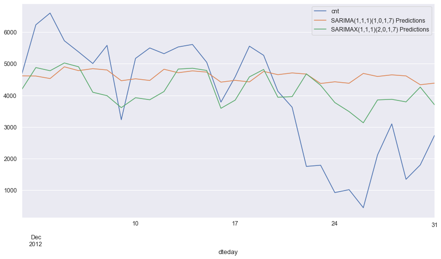

# How to predict bike usage
*[Laurent Guerguy]*

*[Data Analytics, June 2019, Barcelona]*

## Content
- [Project Description](#project-description)
- [Dataset](#dataset)
- [Results](#results)
- [Organization](#organization)
- [Links](#links)

## Project Description
This project looks at trying to predict the usage of bikes in the future as part of a bike sharing system.
This will be achieved by using Time Series predicition with a SARIMA model.

## Dataset
The dataset gives information about the use of the bikesharing system of Washington called Capital Bike for 2011 and 2012. It shows the amount of rides done every day using the bikeshare system, some information about the weather and the type of day (weekday, weekend or holidays).
The data is obtained from the [following website](https://archive.ics.uci.edu/ml/datasets/bike+sharing+dataset).

## Results

By looking at the data for bike usage as a function of days one can see a periodic pattern to the data whereby the usage of bikes is higher during the summer and lower during the winter (see graph below).

### Time series using a week lag

This data can be analyzed using time series. 
In order to check for seasonality in the data the decomposition method is used.

It seems logical to think that the behaviour of people using a bike could be different as a function of the day of the week. Therefore the decomposition is done using a lag of 7 days and it gives the following results:

### Determine hyperparameters p,d and q

In order to apply the SARIMA model (Seasonal ARIMA) one need to determine the value of p,d,q,P,D,Q and m in ARIMA(p,d,q)(P,D,Q)m.
One can determining the values for d and D by counting the number of differencing if any I need to apply to the data and seasonal data before it becomes stationary.

In order to be able to use SARIMA one needs to check for Stationarity. This can be done using the Augmented Dickey Fuller test with the following hypothesis:

𝐻𝑂 (null hypothesis) : The data is not stationary

𝐻𝐴 (alternative hypothesis) : The data is stationary

The result for the p-value of the test is 0.343 so the null hypothesis is valid and the data is not stationary and diferencing needs to be applied. After doing diferencing the data looks stationary (see graph below):

Performing another Augmented Dickey Fuller test gives a p-value of 1.05e-21 so it disproves the null hypothesis and it shows that the data is stationary.
Because the data is stationary after one diferencing one can assume that d=1.

To determine the other parameters of the ARIMA model one can plot the autocorrelation and partial autocorrelation functions ACF and PACF for a lag = 7. The results can be seen in the graph below:

As we have a strong positive autocorrelation at lag-1 and a sharp decrease after that, it means that we should choose p=1. So far we have defined that we would need an ARIMA(1,1,0).

### Determine hyperparameters P,D and Q

 D will be the number of differencing applied to the seasonal data (with lag 7)
 After applying one diferencing with lag 7 and performing the Augmented Dickey Fuller test the p-value is 3.012e-12 so the data is stationary after one diferencing and one can assume D = 1.
 
 In order to determine P and Q one can plot the Autocorrelation and Partial autocorrelation. The graph is presented below:
 
 

This ACF and PACF model suggest an AR type model (as the autocorrelation is positive and decaying towards 0) of 1 as there is a sharp decline after lag-1.

**In the end by combining what we found earlier for p,d,q in ARIMA we suggest a model SARIMA with the parameters SARIMA(1,1,0)(1,1,0)7**

### SARIMA model analysis

First the train and test data need to be defined. The train data will consist of all the data except the last month keeping the last 31 days of data as test.

After applying the model with the following hyperparamters SARIMA(1,1,0)(1,1,0)7 to the train data one can calculate the Aikeke Information Criterion AIC for this specific model in order to get an idea of how effective is the model and compare it with other models.
The AIC is 11784.

In order to find a more efficient model one can perform a grid search in order to find the best hyperparameters using a range between 0 and 2 for all parameters except for m = 7.
After performing the grid search the model with the lowest AIC is ARIMA(1, 1, 1)x(0, 2, 2)7 with AIC = 11089

In order to confirm that we don´t violate any of the assumptions made by the model. The graph is shown below:

We want to check that the residuals of our model are uncorrelated and normally distributed with zero-mean. If the seasonal ARIMA model does not satisfy these properties, it is a good indication that it can be further improved.

In the top right plot, we see that the red KDE line doesn't follow completely the N(0,1) (the standard notation for a normal distribution with mean 0 and standard deviation of 1).

The qq-plot on the bottom left shows that the ordered distribution of residuals (blue dots) follows the linear trend of the samples taken from a standard normal distribution with N(0, 1) but not perfectly. This shows that the residuals are not perfectly normally distributed.

The residuals over time (top left plot) don't display any obvious seasonality and appear to be white noise. This is confirmed by the autocorrelation (i.e. correlogram) plot on the bottom right, which shows that the time series residuals have low correlation with lagged versions of itself.

Because of points 1 and 2 we can see that our model could be further improved.

Nevertheless let's see how this model performs.

### Is the model a good fit?

First one can check how the prediction performs comparesd to the train dataset. The graph is shown below:

The observed and the predicted graphs overlap quite well.

Now let's see what happens if we use the dynamic prediction. The dynamic prediction uses part of the the train data and from this forecasts the rest of the data. This shows how robust the chosen model is.

The graph can be seen below:

The prediction shows that the model is not completely robust. The prediction for the first two months is acceptable but more work is need in order to find a model more performant.

### SARIMA model for the end of year

So far the model had been tested in September as the curve for bike usage towards the end of the year seemed more noisy and therefore more difficult to predict.
We will now focus on trying to train the model on the last month of data available, that is the month of December.
By using s grid search with the pmdarima library we define a new model with the following parameters:
SARIMA(1,1,1)(1,0,1,7)

And when we plot the graph for the trained prediction compared to the test set we get the results below:

One can see that the predicted curve obtained from the SARIMA model does not compare very well to the test set, especially towards the last days of December.
The prediction does very bad especially from day number 20 on. This could be due to a combination of Christmas holidays and bad weather.

The next step will be to see if the prediction improves when one uses exogenous variables available like holidays, weekdays and weather conditions as part of a SARIMAX model

### SARIMAX model for the end of year

We will now try to train the model on the last month of data available with a SARIMAX model using the information we have on whether the day is a holiday or not, a weekday or during the weekend and finally what was the weather that day.

We obtain the following parameters:
SARIMAX(1,1,1)(2,0,1,7)

And when we plot the graph for the trained predictions for SARIMA (orange) and SARIMAX (green) compared to the test set we get the results below:

Using the exogenous variables brings the prediction closer to the test.
This is showm by the value of the Root Mean Square Error is lower for the SARIMAX model (1543 instead of 1845 for SARIMA).

And we can actually see on the graph that the green curve gives a better account of the loss of traffic around Christmas time but this is not enough to account for all the traffic loss.

The next step will be to try to use the Prophet library to model the bike usage.

## Links
Below are  the links to my repository, the presentation slides and Trello board I used to organize the work.

[Repository](https://github.com/laurent-guerguy/Project-5-Bikesharing-Predict-Bike-Usage)   
[Presentation Slides](https://docs.google.com/presentation/d/13CbBFrtWHlciA8Ky1YihT6y0lEv87EUPn0MFe8u8LPM/edit?usp=sharing)  
[Trello board](https://trello.com/b/QaHnwmTY/bike-share-project)  
